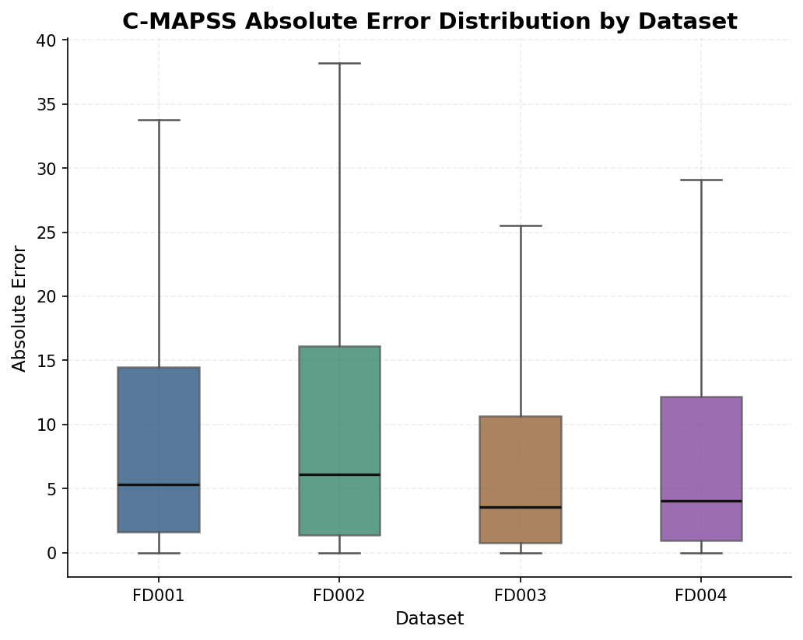
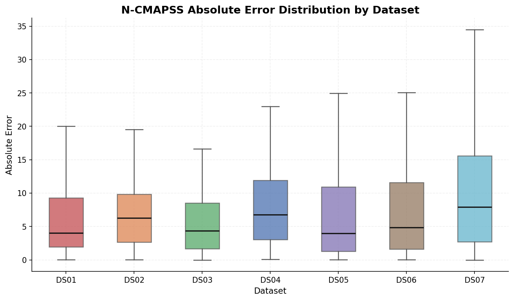

# AeroTrace Turbofan

AeroTrace Turbofan is a repository of benchmark-based predictive maintenance artifacts for turbofan engines. It combines remaining useful life (RUL) prediction outputs, anomaly scores, an explainable maintenance decision layer, a browser-based review app, and digital twin demo assets into one inspectable package.

The repository is organized so a first-time GitHub reader can follow the full path from benchmark data to maintenance-facing outputs without having to retrain every model first.

## Why this repository exists

The project addresses a practical question: how can per-cycle model outputs be turned into maintenance-oriented decisions that a human reviewer can inspect, challenge, and trace back to source artifacts?

The repository packages that workflow around public turbofan benchmark datasets:

- C-MAPSS for classical run-to-failure scenarios.
- N-CMAPSS for richer flight-condition scenarios.
- A deterministic decision policy that maps RUL and anomaly evidence into four maintenance states.
- Front-end and twin layers that make those outputs easier to review.

## Repository map

| Path | What it contains | Why it matters |
| --- | --- | --- |
| [`guides/`](./guides/README.md) | Short GitHub-facing documentation hub | Best starting point for new readers |
| [`data/`](./data) | Raw benchmark inputs, processed datasets, and packaged outputs | Source and derived data assets |
| [`notebooks/`](./notebooks) | Dataset-specific RUL and anomaly work products | Modeling artifacts and exports |
| [`demo/`](./demo/README.md) | Packaged decision-support outputs, policy package, Streamlit dashboard | Fastest way to inspect prepared results |
| [`evaluation/`](./evaluation/README.md) | Curated evaluation figures and summary tables | Canonical location for reviewable model-evaluation visuals |
| [`webapp/`](./webapp/README.md) | Vite web application and preprocessed JSON assets | Interactive fleet and engine exploration |
| [`twin/`](./twin/README.md) | Streamlit-based twin apps, scripts, and hybrid outputs | Digital twin and replay workflows |
| [`figures/`](./figures) | Exported report figures | Visual evidence used in reports |
| [`docs/`](./docs) | Narrative reports and decision-support notes | Supporting evidence and historical context |

## Main components

### 1. Data and modeling artifacts

- Raw C-MAPSS text files are committed under [`data/raw/CMAPSS/`](./data/raw/CMAPSS).
- N-CMAPSS raw data is documented through [`data/raw/N-CMAPSS/README_download.md`](./data/raw/N-CMAPSS/README_download.md), which records the external download and extraction status.
- Processed N-CMAPSS modeling-ready datasets are present for `DS01` to `DS07`, plus `DS08a` and `DS08c`, under [`data/processed/N-CMAPSS/`](./data/processed/N-CMAPSS).
- Notebook folders under [`notebooks/RUL/`](./notebooks/RUL) and [`notebooks/Anomaly/`](./notebooks/Anomaly) hold dataset-specific predictions, reports, and intermediate artifacts.

### 2. Decision-support layer

The repository's central integration step is the maintenance decision layer. It combines RUL outputs and anomaly scores into four recommendation labels:

- `Normal Operation`
- `Enhanced Monitoring`
- `Planned Maintenance`
- `Immediate Maintenance`

Packaged outputs are committed under:

- [`data/processed/outputs/C-MAPSS/`](./data/processed/outputs/C-MAPSS)
- [`data/processed/outputs/N-CMAPSS/`](./data/processed/outputs/N-CMAPSS)
- [`demo/decision_support_v2_outputs/`](./demo/decision_support_v2_outputs)

The reusable policy package lives under [`demo/decision_support_v2_package/`](./demo/decision_support_v2_package).

### 3. Review interfaces

- [`demo/streamlit_dashboard/`](./demo/streamlit_dashboard) provides a lightweight Streamlit review app for the bundled CSV outputs.
- [`webapp/`](./webapp) provides a richer browser UI with fleet summaries, engine timelines, and a twin-oriented view.
- [`twin/`](./twin) contains the Streamlit twin apps, replay scripts, and hybrid outputs used for the digital twin story.

### 4. Evaluation assets

- [`evaluation/`](./evaluation/README.md) contains curated boxplots, scatter plots, residual histograms, and supporting CSV summaries for C-MAPSS and N-CMAPSS evaluation review.
- These assets are intended for GitHub readers who want a direct visual read on model behavior without opening notebooks first.

## Data and asset overview

The repository mixes raw inputs, processed datasets, and ready-to-review outputs. The most immediately useful assets for a first-time reader are:

| Asset type | Location | Notes |
| --- | --- | --- |
| Raw C-MAPSS benchmark files | [`data/raw/CMAPSS/`](./data/raw/CMAPSS) | Train, test, and RUL files for `FD001` to `FD004` |
| N-CMAPSS download record | [`data/raw/N-CMAPSS/README_download.md`](./data/raw/N-CMAPSS/README_download.md) | Documents source download rather than vendoring the full raw archive |
| Processed N-CMAPSS datasets | [`data/processed/N-CMAPSS/`](./data/processed/N-CMAPSS) | Includes per-dataset manifests and README files |
| Decision-support CSV outputs | [`data/processed/outputs/`](./data/processed/outputs) | Structured by dataset family and dataset ID |
| Demo-ready flat CSV outputs | [`demo/decision_support_v2_outputs/`](./demo/decision_support_v2_outputs) | Used by the Streamlit dashboard and related packaging |
| Evaluation figures and summaries | [`evaluation/`](./evaluation/README.md) | Canonical location for boxplots and other reviewable evaluation visuals |
| Web app JSON assets | [`webapp/public/data/`](./webapp/public/data) | Prepared summaries and engine timelines for 11 datasets |
| Figures and report images | [`figures/`](./figures) | Histograms, timeline plots, and policy-comparison charts |

For a fuller inventory, see [`guides/data-assets.md`](./guides/data-assets.md).

## How to explore this repository

Choose the path that matches your role:

| If you are a... | Start here | Then continue with |
| --- | --- | --- |
| Viewer or evaluator | [`guides/README.md`](./guides/README.md) | [`guides/project-overview.md`](./guides/project-overview.md) |
| Developer reviewing the interfaces | [`webapp/README.md`](./webapp/README.md) | [`twin/README.md`](./twin/README.md) |
| Researcher inspecting data and outputs | [`guides/data-assets.md`](./guides/data-assets.md) | [`notebooks/`](./notebooks) and [`docs/`](./docs) |
| Reviewer checking claims and evidence | [`guides/validation-status.md`](./guides/validation-status.md) | [`docs/mvp_feasibility_proof_report.md`](./docs/mvp_feasibility_proof_report.md) |

A practical quickstart is:

1. Read [`guides/project-overview.md`](./guides/project-overview.md) for the end-to-end flow.
2. Open [`guides/data-assets.md`](./guides/data-assets.md) to see which outputs, figures, and evaluation assets are already committed.
3. Browse [`evaluation/README.md`](./evaluation/README.md) for the curated model-evaluation visuals.
4. Open [`webapp/README.md`](./webapp/README.md) for the browser UI or [`twin/README.md`](./twin/README.md) for the digital twin workflows.

## Visual highlights

The repository now includes curated evaluation figures under [`evaluation/`](./evaluation/README.md). Two representative boxplots are shown below.

`evaluation/absolute_error_boxplot_by_dataset_cmapss.png` compares the spread of absolute prediction error across `FD001` to `FD004`, making it easy to see dataset-level variation rather than a single aggregate metric.

`evaluation/absolute_error_boxplot_by_dataset_ncmapss.png` shows the same error-distribution view for `DS01` to `DS07`, giving a compact visual summary of how prediction error varies across the N-CMAPSS scenarios.

For the full boxplot set, scatter plots, residual histograms, and supporting CSV files, see [`guides/data-assets.md`](./guides/data-assets.md) and [`evaluation/README.md`](./evaluation/README.md).

## Documentation map

- Docs landing page: [`guides/README.md`](./guides/README.md)
- Project flow and component relationships: [`guides/project-overview.md`](./guides/project-overview.md)
- Data, outputs, figures, and asset locations: [`guides/data-assets.md`](./guides/data-assets.md)
- Evidence, caveats, and validation limits: [`guides/validation-status.md`](./guides/validation-status.md)

Component-specific entry points:

- Demo package and Streamlit dashboard: [`demo/README.md`](./demo/README.md)
- Web application: [`webapp/README.md`](./webapp/README.md)
- Digital twin: [`twin/README.md`](./twin/README.md)

## Current status and limitations

- The repository contains prepared outputs for C-MAPSS `FD001` to `FD004` and N-CMAPSS `DS01` to `DS07`, plus additional processed N-CMAPSS assets for `DS08a` and `DS08c`.
- The public structure is optimized for inspection, demos, and documentation rather than for one-command end-to-end retraining.
- Some narrative reports still reference older absolute paths or historical layouts. Those files remain useful as evidence, but not all of them are turnkey runbooks.
- Reports and notes are mixed between English and Turkish. The guides in [`guides/`](./guides/README.md) are intended to be the clean GitHub-facing navigation layer.
