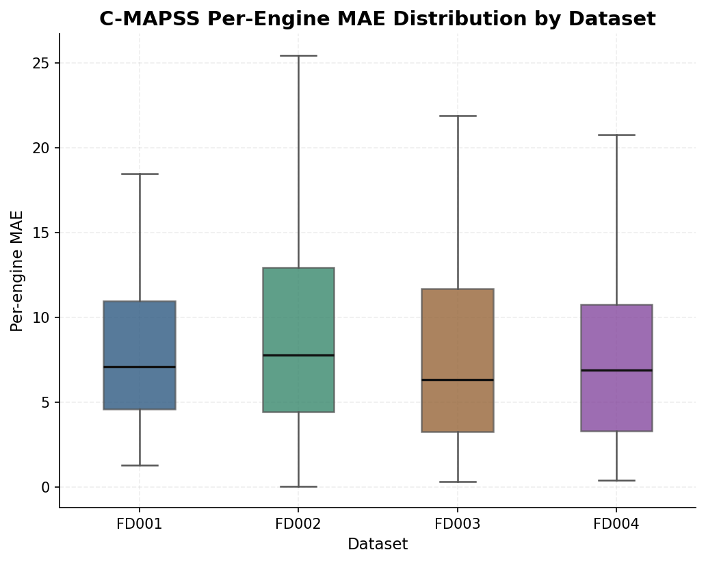
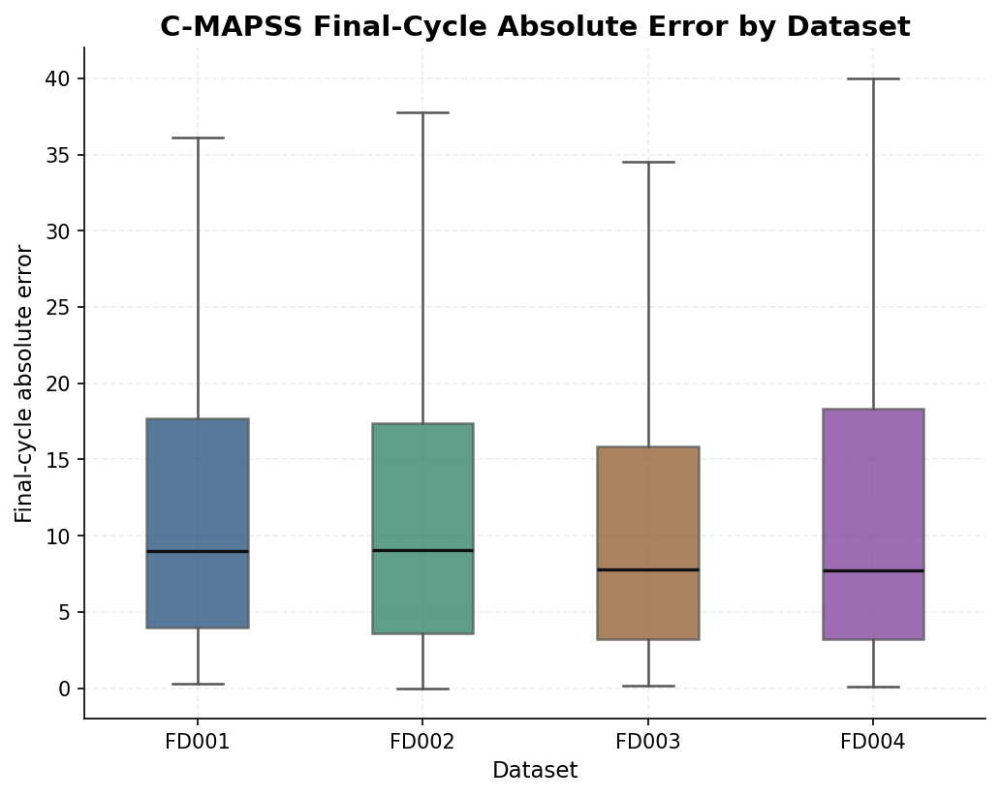
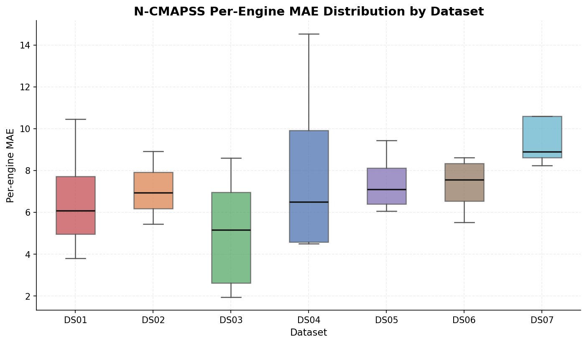
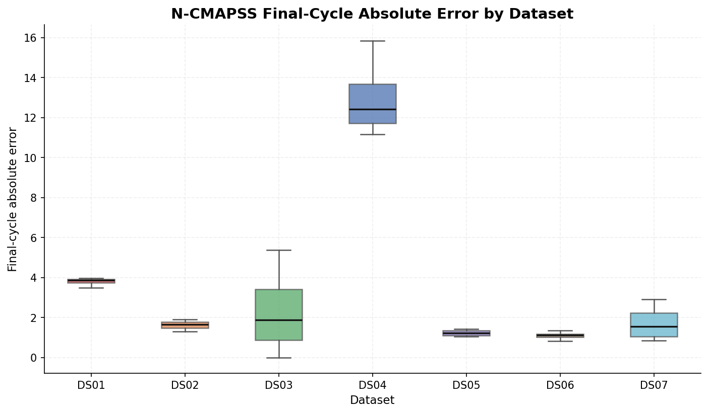

# Data and Assets

This guide explains what data, outputs, and visuals are actually committed to the repository. It is meant to answer a practical onboarding question: where should a reader look for the source data, the prepared outputs, and the figures that support the project story?

## Asset categories at a glance

| Category | Main location | What is inside |
| --- | --- | --- |
| Raw benchmark data | [`../data/raw/`](../data/raw) | C-MAPSS raw files and the N-CMAPSS download record |
| Processed modeling assets | [`../data/processed/`](../data/processed) | Normalized datasets, manifests, and structured outputs |
| Notebook artifacts | [`../notebooks/`](../notebooks) | Dataset-specific predictions, reports, and analysis outputs |
| Demo-ready outputs | [`../demo/decision_support_v2_outputs/`](../demo/decision_support_v2_outputs) | Flat CSV exports and audit files |
| Evaluation assets | [`../evaluation/`](../evaluation) | Canonical evaluation figures and supporting summary tables |
| Web app assets | [`../webapp/public/data/`](../webapp/public/data) | JSON summaries and per-engine timeline files |
| Twin assets | [`../twin/data/`](../twin/data) and [`../twin/inputs/`](../twin/inputs) | Policy inputs, hybrid outputs, and replay inputs |
| Figures and report visuals | [`../figures/`](../figures) | Histograms, timelines, and policy-comparison plots |

## Raw data

### C-MAPSS

The repository commits the raw C-MAPSS benchmark files for `FD001` to `FD004` under [`../data/raw/CMAPSS/`](../data/raw/CMAPSS).

Examples:

- [`../data/raw/CMAPSS/FD001_raw_dataset/train_FD001.txt`](../data/raw/CMAPSS/FD001_raw_dataset/train_FD001.txt)
- [`../data/raw/CMAPSS/FD004_raw_dataset/test_FD004.txt`](../data/raw/CMAPSS/FD004_raw_dataset/test_FD004.txt)
- [`../data/raw/CMAPSS/FD004_raw_dataset/RUL_FD004.txt`](../data/raw/CMAPSS/FD004_raw_dataset/RUL_FD004.txt)

### N-CMAPSS

The full raw N-CMAPSS archive is not vendored into the repository, but the download and extraction status is documented in [`../data/raw/N-CMAPSS/README_download.md`](../data/raw/N-CMAPSS/README_download.md).

That note records:

- the source URL used for download,
- the reported download timestamp,
- the extracted HDF5 inventory,
- and the note that `DS08d` appears truncated in the source archive.

## Canonical committed assets

The most reliable source-of-truth assets in this repository are the committed raw files, processed datasets, structured output folders, and packaged app assets. These are the files to cite first when documenting what is present.

## Processed datasets and structured outputs

### Processed modeling datasets

[`../data/processed/N-CMAPSS/`](../data/processed/N-CMAPSS) contains modeling-ready per-dataset folders with:

- `train_*.csv`
- `test_*.csv`
- `scaler_*.json`
- `README.md`
- `manifest.json`

The upload manifest at [`../data/processed/N-CMAPSS/_UPLOAD_MANIFEST.md`](../data/processed/N-CMAPSS/_UPLOAD_MANIFEST.md) records passes for `DS01` to `DS07`, `DS08a`, and `DS08c`, and a skip for `DS08d`.

The older C-MAPSS processed-area folders under [`../data/processed/CMAPSS/`](../data/processed/CMAPSS) appear to store normalization variants and prepared datasets rather than final GitHub-facing outputs.

### Decision-support outputs

The most important ready-to-review outputs are under [`../data/processed/outputs/`](../data/processed/outputs):

| Output family | Coverage in repo | Typical files |
| --- | --- | --- |
| C-MAPSS | `FD001` to `FD004` | `*_rul_predictions.csv`, `*_anomaly_scores.csv`, `*_decision_support.csv`, reports |
| N-CMAPSS | `DS01` to `DS07` | `*_rul_predictions_autogluon_FIXED.csv`, `*_anomaly_scores.csv`, `*_decision_support_v2.csv` |

These are the best locations when you want the structured outputs behind the demos without reading the notebook directories directly.

## Downstream and demo-friendly exports

### Demo and packaged review outputs

[`../demo/decision_support_v2_outputs/`](../demo/decision_support_v2_outputs) stores flat, demo-friendly exports. This folder is useful because:

- the naming is easier to browse than the deeper notebook structure,
- the Streamlit dashboard reads from it by default,
- and the `audit/` subfolder keeps policy comparison and generation summaries close to the outputs.

### Web app assets

[`../webapp/public/data/`](../webapp/public/data) stores the data that the browser app actually serves:

- [`../webapp/public/data/datasets.json`](../webapp/public/data/datasets.json) lists the 11 active datasets,
- each dataset folder contains `fleet_summary.json`,
- and per-engine timeline JSON files live in each dataset's `engines/` subfolder.

This is the most downstream representation of the data in the repository.

### Twin assets

Twin-related data is split between:

- [`../twin/inputs/`](../twin/inputs) for prepared inputs,
- [`../twin/data/decision_support_v2_outputs/`](../twin/data/decision_support_v2_outputs) for policy-oriented inputs,
- and [`../twin/data/hybrid_phase2/`](../twin/data/hybrid_phase2) for hybrid replay outputs.

The hybrid summary table at [`../twin/data/hybrid_phase2/hybrid_phase2_summary.csv`](../twin/data/hybrid_phase2/hybrid_phase2_summary.csv) currently contains rows for `DS03` and `DS04`, while dataset folders for `DS01` to `DS07` are present in the same area.

## Evaluation assets

[`../evaluation/`](../evaluation) is now the canonical location for reviewable model-evaluation visuals in this repository. It contains:

- dataset-level boxplots for C-MAPSS and N-CMAPSS,
- true-vs-predicted scatter plots,
- residual histograms,
- per-dataset and per-engine CSV summaries,
- and an evaluation manifest.

For folder-level navigation, see [`../evaluation/README.md`](../evaluation/README.md).

### Evaluation boxplots

The six core boxplots are grouped below by dataset family.

#### C-MAPSS

`../evaluation/absolute_error_boxplot_by_dataset_cmapss.png` shows the distribution of absolute prediction error for `FD001` to `FD004`.

`../evaluation/per_engine_mae_boxplot_by_dataset_cmapss.png` summarizes per-engine mean absolute error, which is useful for seeing whether a dataset's aggregate quality is being driven by a smaller number of difficult engines.

`../evaluation/final_cycle_abs_error_boxplot_by_dataset_cmapss.png` focuses on final-cycle error, highlighting end-of-life prediction behavior where maintenance timing is most sensitive.

#### N-CMAPSS

`../evaluation/absolute_error_boxplot_by_dataset_ncmapss.png` shows the absolute error spread across `DS01` to `DS07`.

`../evaluation/per_engine_mae_boxplot_by_dataset_ncmapss.png` compares per-engine average error across the N-CMAPSS scenarios.

`../evaluation/final_cycle_abs_error_boxplot_by_dataset_ncmapss.png` isolates final-cycle absolute error for the N-CMAPSS datasets.

### Other evaluation figures

The folder also includes two useful non-boxplot overview pairs:

- True-vs-predicted scatter plots:
  - [`../evaluation/true_vs_pred_scatter_cmapss.png`](../evaluation/true_vs_pred_scatter_cmapss.png)
  - [`../evaluation/true_vs_pred_scatter_ncmapss.png`](../evaluation/true_vs_pred_scatter_ncmapss.png)
- Residual histograms by dataset:
  - [`../evaluation/residual_histogram_by_dataset_cmapss.png`](../evaluation/residual_histogram_by_dataset_cmapss.png)
  - [`../evaluation/residual_histogram_by_dataset_ncmapss.png`](../evaluation/residual_histogram_by_dataset_ncmapss.png)

These are useful companion views, but the boxplots above are the primary evaluation visuals for quick comparison.

## Other visual locations

`../evaluation/` is the canonical GitHub-friendly folder for curated evaluation artifacts. Broader historical and report-oriented visuals still live in:

- [`../figures/mvp_report/c-mapss/`](../figures/mvp_report/c-mapss)
- [`../figures/mvp_report/n-cmapss/`](../figures/mvp_report/n-cmapss)
- [`../figures/decision_support/c-mapss/`](../figures/decision_support/c-mapss)
- [`../figures/decision_support/ncmapss_all/`](../figures/decision_support/ncmapss_all)
- [`../notebooks/RUL/C-MAPSS/FD001/FD001_Ozcan_AllRaws/ozcan.pdf`](../notebooks/RUL/C-MAPSS/FD001/FD001_Ozcan_AllRaws/ozcan.pdf)

If you want the cleanest evaluation view, start with [`../evaluation/`](../evaluation). If you want the broader project figure history, continue into [`../figures/`](../figures), [`../docs/`](../docs), and selected notebook/report artifacts.
