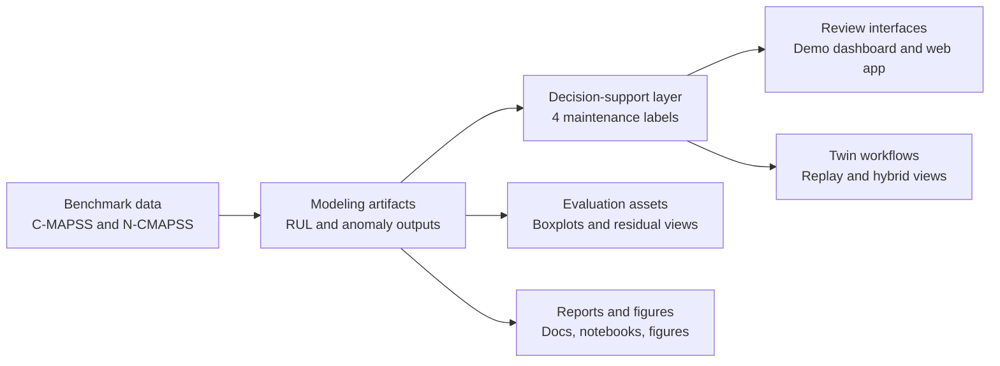

# Project Overview

AeroTrace Turbofan brings together benchmark data, model outputs, a rule-based maintenance policy, and review interfaces for turbofan predictive maintenance. The repository is built around inspectable artifacts: a reader can move from benchmark datasets to outputs, reports, dashboards, and twin views without first reconstructing the whole training pipeline.

## The big picture

At a high level, the repository connects five layers:

## End-to-end flow

### 1. Benchmark data enters the repository

- [`data/raw/CMAPSS/`](../data/raw/CMAPSS) contains the committed C-MAPSS train, test, and RUL text files for `FD001` to `FD004`.
- [`data/raw/N-CMAPSS/README_download.md`](../data/raw/N-CMAPSS/README_download.md) documents the external N-CMAPSS archive download and extraction status.

### 2. Dataset-specific modeling artifacts are stored

- [`notebooks/RUL/`](../notebooks/RUL) contains RUL-related artifacts for C-MAPSS and N-CMAPSS datasets.
- [`notebooks/Anomaly/`](../notebooks/Anomaly) contains anomaly-related data, scripts, and outputs.
- [`data/processed/N-CMAPSS/`](../data/processed/N-CMAPSS) contains modeling-ready normalized N-CMAPSS datasets with manifests.

### 3. Decision-support outputs are produced

The repository's central integration step is the maintenance decision layer, which converts model outputs into:

- `Normal Operation`
- `Enhanced Monitoring`
- `Planned Maintenance`
- `Immediate Maintenance`

Committed outputs appear in:

- [`data/processed/outputs/C-MAPSS/`](../data/processed/outputs/C-MAPSS)
- [`data/processed/outputs/N-CMAPSS/`](../data/processed/outputs/N-CMAPSS)
- [`demo/decision_support_v2_outputs/`](../demo/decision_support_v2_outputs)

The reusable packaged policy implementation lives in [`demo/decision_support_v2_package/`](../demo/decision_support_v2_package).

### 4. Outputs are packaged for human review

- [`demo/streamlit_dashboard/`](../demo/streamlit_dashboard) reads the flat CSV outputs.
- [`webapp/`](../webapp) serves preprocessed JSON summaries and engine-level timelines for interactive exploration.
- [`evaluation/`](../evaluation/README.md) contains the canonical evaluation visuals, including dataset-level boxplots, scatter plots, and residual histograms.
- [`figures/`](../figures) contains report-ready PNG exports, especially timeline, distribution, and policy-comparison visuals.
- [`docs/`](../docs) contains narrative reports, snapshots, and feasibility notes.

### 5. Twin workflows reuse the prepared outputs

- [`twin/scripts/`](../twin/scripts) contains replay and hybrid processing scripts.
- [`twin/data/hybrid_phase2/`](../twin/data/hybrid_phase2) contains hybrid timeline outputs and summaries.
- [`twin/app/`](../twin/app) contains the Streamlit twin interfaces.

## How the major folders relate

| Folder | Role in the project | Relationship to the rest of the repo |
| --- | --- | --- |
| [`data/`](../data) | Canonical storage for raw, processed, and structured outputs | Upstream source for many downstream artifacts |
| [`notebooks/`](../notebooks) | Dataset-specific experimentation and exported results | Feeds or documents RUL and anomaly outputs |
| [`demo/`](../demo) | Packaged decision-support outputs and review app | Simplifies inspection without retraining |
| [`evaluation/`](../evaluation/README.md) | Curated model-evaluation figures and CSV summaries | Primary location for quick visual performance review |
| [`webapp/`](../webapp) | Interactive browser layer | Uses preprocessed JSON derived from decision-support outputs |
| [`twin/`](../twin) | Replay and digital twin layer | Reuses policy outputs for simulation-oriented views |
| [`figures/`](../figures) | Saved report visuals | Visual evidence for reports and docs |
| [`docs/`](../docs) | Narrative and audit-style reports | Adds context, but may include historical assumptions |

## Dataset coverage visible in the repository

| Dataset area | Coverage visible in committed files | Notes |
| --- | --- | --- |
| C-MAPSS raw data | `FD001` to `FD004` | Raw benchmark files are committed |
| C-MAPSS decision-support outputs | `FD001` to `FD004` | Present under [`data/processed/outputs/C-MAPSS/`](../data/processed/outputs/C-MAPSS) |
| N-CMAPSS processed datasets | `DS01` to `DS07`, `DS08a`, `DS08c` | Present under [`data/processed/N-CMAPSS/`](../data/processed/N-CMAPSS) |
| N-CMAPSS active decision-support outputs | `DS01` to `DS07` | Present under [`data/processed/outputs/N-CMAPSS/`](../data/processed/outputs/N-CMAPSS) and [`demo/decision_support_v2_outputs/`](../demo/decision_support_v2_outputs) |
| Web app dataset coverage | `FD001` to `FD004`, `DS01` to `DS07` | Reflected in [`../webapp/public/data/datasets.json`](../webapp/public/data/datasets.json) |
| Twin hybrid summaries | Evidence currently committed for `DS03` and `DS04` in summary tables, with hybrid files present for `DS01` to `DS07` | See [`../twin/data/hybrid_phase2/`](../twin/data/hybrid_phase2) |

## What this repository is and is not

### What it is

- A reviewable bundle of predictive-maintenance artifacts for turbofan benchmarks.
- A bridge between model outputs and maintenance-language decisions.
- A repository with both interface-facing assets and report-facing evidence.

### What it is not

- A single-command retraining pipeline for the entire project.
- A fully validated real-world deployment package.
- A substitute for the dataset papers, operational data, or field maintenance records.

## Where to go next

- For the asset inventory, continue to [`data-assets.md`](./data-assets.md).
- For evidence and caveats, continue to [`validation-status.md`](./validation-status.md).
- For interface-specific setup, use [`../webapp/README.md`](../webapp/README.md) and [`../twin/README.md`](../twin/README.md).
